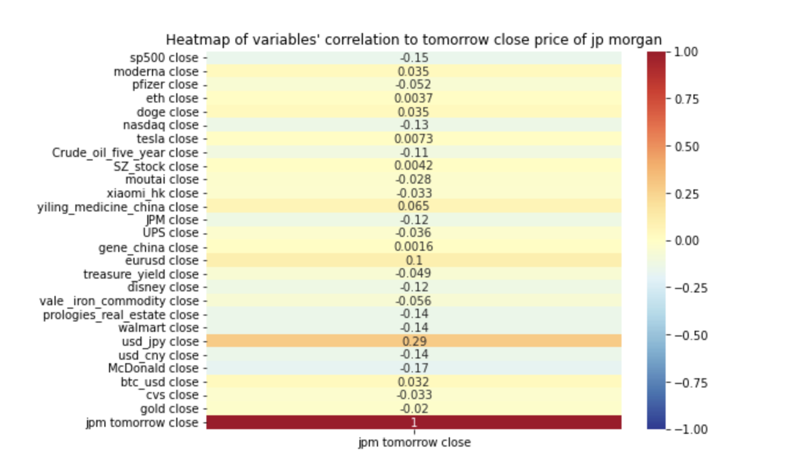

### Project Summary

We want to access the predictability of the stock market based on knowledge learned in CIS 545 at the University of Pennsylvania. Predicting the stock market is extremely challenging. Many researchers and practitioners in this field have attempted to model and predict the future stock prices. It is also widely accepted that the price of the stock market is event-driven, which means it is not predictable at all.

Our research supports the first tier of the efficient market hypothesis — the weak form in that our ARIMA Model does not succeed in predicting the future trend of the stock price solely based on daily historical data. However, from the results of multiple tree-based algorithms and neural networks, we cannot fully validate the semi-strong form of the EMH. Our best performing model — random forest produces an accuracy of 63.8%. On average, our models produce an accuracy of 57.7%, which is significantly higher than the odds of random guesses and close to that of some high-ranked quantitative tradings.

### Multiple Layouts

The files included with the theme have a contact page ready for copy/paste, or
you can type `hugo new forms/contact.md` and you're off to the races. There are two
layouts for `forms` – `split-right`, and `split-left` – you guessed it, one puts
the form on the right and the other on the left. You just fill out the front
matter, and the rest is automatic.

