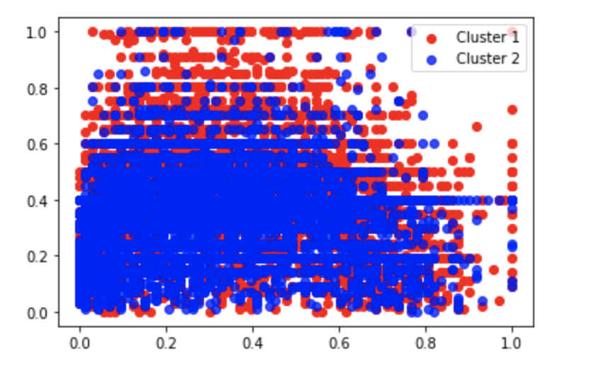

Our dataset contains demographic information of a person to estimate their salary. Specifically, this is a dataset at the individual level, including individuals' characteristics (features) and their income (i.e., income greater than or less than 50K per year). This dataset has and a total number of 44,856 observations, with each row representing an individual. There are 15 variables; 14 features; 1 label. In terms of data type, 8 of the columns are objects, while 7 are integers (int64). We sourced this dataset from Kaggle, and the dataset comes from a US public database.

From the introductory data analysis, we keep age, hours per week, education, relationship, work-class, marital status, native-country, and occupation as they all have statistically significant relationships with the target variable.

We used both supervised learning and unsupervised learning. We compared Naïve Bayes, Logistic Regression, SVMs, Decision Trees, Random Forests, and Adaboost and agreed on Adaboost to be the most efficient model for prediction. Then we selected standardized features in Adaboost model and condcuted Principle Compoment Analysis and K-mean clusters.

