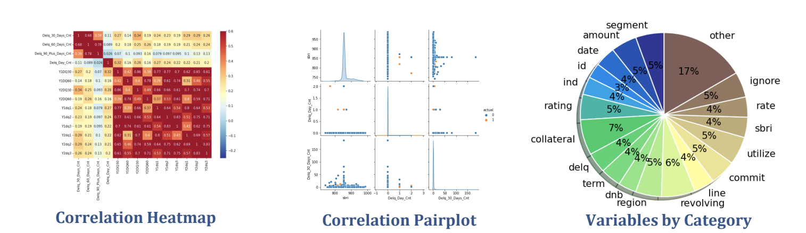
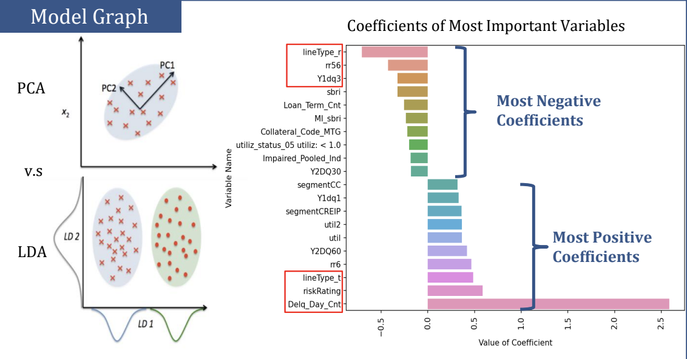
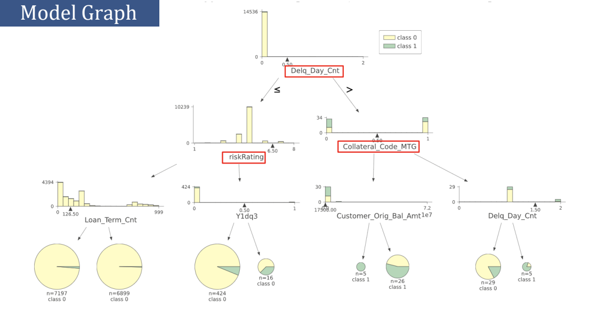
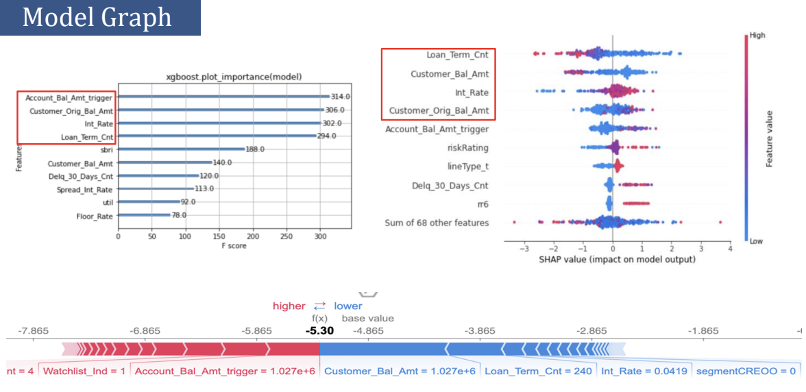

---

### Linear Discriminant Analysis
The linear Discriminant Analysis model is one of the newest models in credit risk scoring techniques. It is valued so highly in the market because it reduces the number of features to achieve a more manageable data size before classification. The model finds linear combinations of features in order to separate default versus non-default. We chose LDA over PCA because PCA ignores the actual class labels for default versus non-default, so we only used PCA as a reference case to visualize our high-dimensional data, but focused on the results of LDA.

Our model achieved 98.8% overall accuracy, correctly identified 22.4% of actual default cases, and out of all the positive default predictions, 38.1% were correct. This is 7% higher in accuracy and a much better balance between precision and recall than the previous model. We then drew a feature coefficients graph and ranked their importance in their effect on default. We can see that,  delinquency days count, risk rating score and indicator for term loans, are among the top ranked features. 

### Decision Tree
The second model of our choice is Decision Tree. We choose this algorithm because unlike many other machine learning models which are close to black boxes, decision tree can provide a graphical and intuitive way to understand what our algorithm is actually doing, so it’s much easier to offer sensible interpretation. The feature ranking graph demonstrates the significance of delinquency count and risk rating score in predicting default, but more importantly, the graph shows that the mortgage collateral and remaining months left in the loan are highly relevant to the possibility of default. 

The model has the outcomes of 98.0% overall accuracy, 20.6% recall, 19.1% precision. 

### XGBoost

XGboost is a decision-tree-based ensemble algorithm that uses a gradient boosting framework to create multiple tree models and combine them to produce improved results. Our model achieved 98.9% overall accuracy, identified 18.3% of actual default cases, and out of all the positive predictions,  65% were correct. We also created the visualizations for the shap value, which is a metric of quantifying the contribution that each feature brings to the prediction of default rate. We find that factors such as loan term count, customer balance amount and interest rate are of high importance.

### Business Insights

First, Fulton Bank should closely monitor macro fluctuations in the market. The agreed-upon interest rate for /each loan, directly affects default rate. 
Also, the default rate decreased during Covid-19, so Fulton bank should also pay attention to default rate when economics recover. 
Moreover, Maryland, Virginia and New Jersey, have a higher chance of default. 
 
Second, segments of investment property and owner occupied commercial real estate stand out in the models, Fulton Bank should track customers with real estate loans that are commercial or related to investment. 
 
Third, Customers with line types of credit loans and term loans are more likely to default. So, Fulton Bank should monitor both flexible and inflexible repayment schedules of the loans.
 
Fourth, Fulton Bank should watch customers whose collateral type are mortgages and moveable assets, such as car titles.
Those whose collateral types are life insurance or bonds, are not relevant to default rate.
 
Lastly, conventional credit score determinants are important in predicting default all the time.

To evaluate customers’ ability to meet obligations of loan agreements, Fulton Bank should monitor customers' financial health by delinquency, account balances and utilization of credits.

