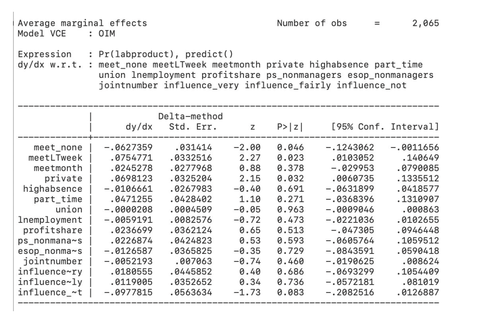
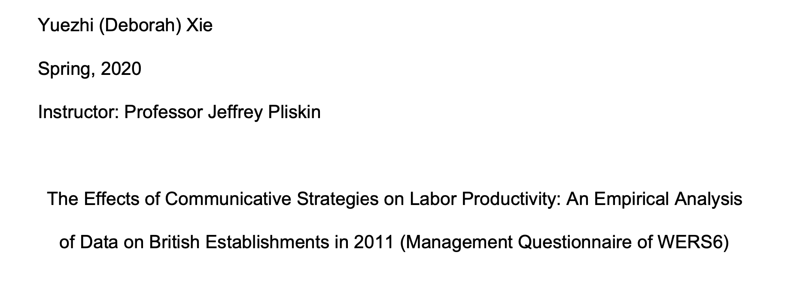

---

The result of this econometric studies indicates that communicative strategies overall have an effect on labor productivity and that other factors besides communicative measurements will influence such effect. Even though some coefficients in the probit model and average marginal effect are not statistically significant, their positive/negative signs will indicate increase/decrease of probability of labor productivity.
Contrary to the common beliefs that joint consultative committees and unions both have determining effects on labor productivity, this study shows that their effects are not as significant. The coefficient on variable “union” is very close to zero and not statistically significant, while the joint effect test on the JCC variables show no statistical significance either. However, the coefficient of influence_not is one of the few that are statistically significant, so it might suggest that if workers think JCC is not influential, there is less probability of an increase in labor productivity. Therefore, JCC might not be that important to this collection of samples, but definitely indispensable.
The non-communicative factors in the chosen variable group are also influential to labor productivity. Variables such as private, ps_nonmanagers and part_time all have distinguishable coefficients, though only private is statistically significant. Due to the changes in coefficient values and p-values from the probit regression to average marginal effect, we can see that these non-communicative factors affect the level of influence of communicative strategies.
Overall, the results of this econometric study show that communicative strategies have a general effect on labor productivity despite other factors of the establishments or their pay systems. Although the study involves some statistically insignificant results that might weaken the argument, we can still draw this conclusion based on the combined analytical strength of the probit model, the joint effect test and the average marginal effect.
To clarify the effect of communicative strategies on labor productivity, a possible direction for further work is to compare specifically the difference in effect between union and non-union workers or to use financial performance instead of labor productivity to see if there is difference in outcome. It is also important to categorize different communicative strategies and see if there is a joint effect between any pair of individual strategies.

